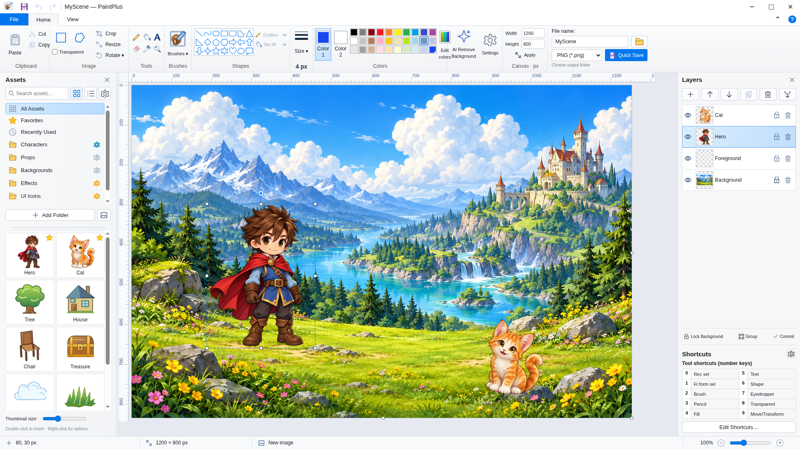

# PaintPlus

A local Windows Paint-style editor with layers, assets, editable shapes and text,
and offline background removal.

**[Download PaintPlus 1.0.2 Setup for Windows](https://github.com/RicFlairIsMyGrandad/MS-Paint-v2-high-effort-/raw/refs/heads/main/downloads/PaintPlus-Setup-1.0.2-x64.exe)**

[Portable EXE](https://github.com/RicFlairIsMyGrandad/MS-Paint-v2-high-effort-/raw/refs/heads/main/downloads/PaintPlus-Portable-1.0.2-x64.exe) · [Complete source ZIP](https://github.com/RicFlairIsMyGrandad/MS-Paint-v2-high-effort-/raw/refs/heads/main/downloads/PaintPlus-Source-1.0.2.zip) · [Full source as TXT](https://github.com/RicFlairIsMyGrandad/MS-Paint-v2-high-effort-/raw/refs/heads/main/downloads/PaintPlus-Full-Source.txt)



## Install

1. Download **PaintPlus-Setup-1.0.2-x64.exe** and run it on a 64-bit Windows 10 or
   Windows 11 computer. The installer can update an existing PaintPlus installation.
2. Choose the installation folder and complete the wizard. Open PaintPlus from
   the desktop or Start menu shortcut. Node.js, Python and other developer tools
   are not required.
3. The executable is unsigned. If Windows displays SmartScreen, review the file
   and its checksum; **More info → Run anyway** is the Windows option for running
   a trusted unsigned application.

The portable EXE runs without installation. Both downloads include the AI model
and runtime. There are no model downloads, online AI calls or telemetry. Uninstall
preserves projects, source assets and user preferences.

Version 1.0.2 includes the earlier blank-window startup fixes: software rendering
on Windows, ASAR-aware resource loading, correct script/WASM types, a visible
startup error screen and diagnostics at `%APPDATA%\\PaintPlus\\startup.log`.
Hosted native checks are documented in [TESTING.md](docs/TESTING.md); the user's
Home-edition laptop remains a separate hardware check.

## Editing

- Zoom uses only Paint's eleven fixed levels (12.5% through 800%). Image pixels
  stay sharp and selection handles keep a constant screen size.
- Draw a shape, then move/resize/rotate it or change its outline/fill. Ctrl+Numpad
  Plus/Minus changes the current stroke width by one pixel. Enter commits it.
- Drag a text box and type directly on the canvas. The Text ribbon controls
  formatting, spacing, padding and an optional rounded speech bubble. Finished
  text can be resized and double-clicked to edit again. Ctrl+Enter ends typing;
  Enter outside typing commits selected content to raster pixels.
- Rectangular/free-form selection buttons sit side by side. **8** toggles exact
  Color-2 transparency. Ctrl+A still selects all. Default Paint behavior commits
  a pixel selection when you click outside; Settings also offers persistent mode.
  Shift-drag or Shift-arrow stamps a trail; arrows move one pixel per press.
- The Brush picture selects round or the last brush used. The lower arrow opens
  brush choices. Size shows the current width. Right-drag uses Color 2; right-click
  a palette swatch sets Color 2.
- Ribbon Width/Height + Apply changes canvas boundaries without stretching.
  Larger pastes grow the canvas by default; Settings can retain its dimensions.
- A layer's bin or Delete after clicking its row removes it immediately. Ctrl+Z
  restores it. Locked layers must be unlocked first. Ctrl+Z/Y affects document
  history even when the filename field has focus.
- Double-click an asset to insert it at its original size and (0,0). Drag the
  Assets panel's right edge and folder/thumbnail divider to change proportions.
  Category gear or right-click menus add, rename and remove indexed folders.
  Originals are preserved. Library removals do not affect inserted project objects.
- AI Remove Background runs the bundled U2NetP model locally on CPU. The refinement
  panel allows canvas zoom, recoverable threshold adjustment, hard edges and
  adjustable softness. Complex subjects may still need manual cleanup.
- Quick Save uses the filename, format and remembered folder; filename collisions
  produce numbered files. PNG preserves alpha; JPEG/BMP use a white matte.
  Copy preserves original selected colors and uses Color 2 to matte genuine alpha
  for applications such as MS Paint. Save **.paintplus** for editable layers,
  source images, text, shape geometry and groups.

[Release notes and issue-by-issue results](docs/RELEASE-1.0.2.md) ·
[Known limitations](docs/LIMITATIONS.md) · [Test evidence](docs/TESTING.md)

Exact Microsoft icon/cursor files and pixel-identical UI proportions are unfinished.
The included colored icons and custom cursors are Paint-style redraws. Other
remaining differences are listed explicitly in the limitations document.

## Development

Use Node.js 22.12+ or 24. See [BUILD.md](docs/BUILD.md) for cloud setup, native tests
and installer construction.

```sh
npm ci
npm run dev
npm test
npm run test:ui
npm run package:win
```

The source downloads include application code, tests, original demo artwork,
model, build tools and packaging instructions. The TXT contains every UTF-8 source
file verbatim and indexes binary assets provided in the ZIP.
